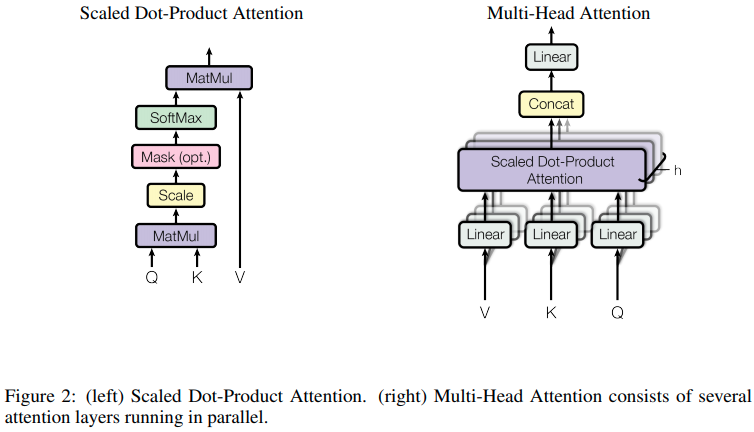

Title: Math explained and visualized
Author: SergeM
Date: 2017-05-20 22:00
Slug: math-exmplined-and-visualized
Tags: math,books,links,eli5

Here I will collect links to well-written articles about math and algorithms. 

[Visual Information Theory](http://colah.github.io/posts/2015-09-Visual-Information/). Nice post about probabilities, entropy. The [whole blog](http://colah.github.io/) has awesome visualizations. Highly recommended.

[MNIST For ML Beginners](https://www.tensorflow.org/get_started/mnist/beginners) - Nice introduction into machine learning with TensorFlow

[Brilliantly wrong](http://arogozhnikov.github.io/) - blog by Alex Rogozhnikov, with fantastic visualizations of many algorithms and concepts

[Collection of data science notebooks](https://github.com/donnemartin/data-science-ipython-notebooks). 

[Deconvolution and Checkerboard Artifacts](https://distill.pub/2016/deconv-checkerboard/) by 
Odena, et al., 2016 - explanation of
deconvolution operation in neural networks with awesome interactive visualizations

[Up-sampling with Transposed Convolution](https://towardsdatascience.com/up-sampling-with-transposed-convolution-9ae4f2df52d0) one more article about deconvolutions with good examples

More about deconvolutions in Tensorflow on [stack overflow](https://stackoverflow.com/questions/39373230/what-does-tensorflows-conv2d-transpose-operation-do)

[A guide to convolution arithmetic for deeplearning](https://arxiv.org/pdf/1603.07285.pdf), Vincent Dumoulin, Francesco Visin, 2018 

[https://ncase.me/](https://ncase.me/) - Interactive math experiments

### Transformer model

[Jay Alammar. Visualizing machine learning one concept at a time](http://jalammar.github.io/) - nice visualization and explanamtion of some ML concepts and architectures. For example: [The Illustrated Transformer](http://jalammar.github.io/illustrated-transformer/)

[The Annotated Transformer](http://nlp.seas.harvard.edu/2018/04/03/attention.html) - description with code (notebook)

[original paper](https://arxiv.org/abs/1706.03762)

### Object detection

[Object detection: speed and accuracy comparison (Faster R-CNN, R-FCN, SSD, FPN, RetinaNet and YOLOv3)](https://medium.com/@jonathan_hui/object-detection-speed-and-accuracy-comparison-faster-r-cnn-r-fcn-ssd-and-yolo-5425656ae359)

[mAP (mean Average Precision) for Object Detection](https://medium.com/@jonathan_hui/map-mean-average-precision-for-object-detection-45c121a31173)

[Object Detection. Распознавай и властвуй. Часть 2](https://habr.com/en/company/jetinfosystems/blog/498652/)

### About quaternions

[https://eater.net/quaternions/](https://eater.net/quaternions/)

<iframe width="560" height="315" src="https://www.youtube.com/embed/zjMuIxRvygQ" frameborder="0" allow="accelerometer; autoplay; encrypted-media; gyroscope; picture-in-picture" allowfullscreen></iframe>

See also:

* [Machine learning links](/machine-learning-links.html)

