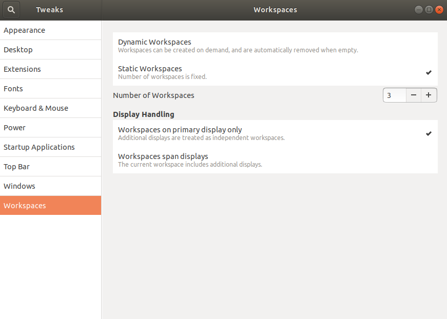

Title: Ubuntu/linux settings
Author: SergeM
Date: 2018-01-11 08:00
Slug: ubuntu-linux-settings
Tags: linux,useful,settings,ubuntu,shell, ubuntu 18


Some settings I find useful for a workstation

## CPU monitoring on the main panel
Default Ubuntu desktop seems to become finally convenient enough for me starting from Ubuntu 18.04. 
Only several tweaks are missing.
Constantly available CPU/Mem/HDD/Network monitor is one of them.
Here is how to install a small widget for a top panel in the default GNOME desktop environment.

1. ```sudo apt-get install gir1.2-gtop-2.0 gir1.2-networkmanager-1.0  gir1.2-clutter-1.0```

2. Go to **Ubuntu Software** and then search for `system monitor extension`. Install one named `system-monitor`: 

    >  Display system information in GNOME Shell status bar

3. After the installation you should see a new applet in the main pannel. One can find settings in the context menu.


## Desktop, workspaces and gnome extensions settings in Ubuntu 18.04
### only show applications of current workspace in launcher:

```
sudo apt install dconf-editor
```

Navigate to org > gnome > shell > extensions > dash-to-dock and check isolate-workspaces

### Show workspace indicator in the main pannel

Enable "Workspace Indicator" extension.


### Static number of workspaces




## Autocomplete in shell
See [autocomplete from history in terminal](/autocomplete-from-history-in-terminal.html)


## Set `nemo` as default file manager 
```
xdg-mime default nemo.desktop inode/directory application/x-gnome-saved-search
```

now if you run `xdg-open ./` or press `Super+E` nemo starts.

[source](http://www.fandigital.com/2013/01/set-nemo-default-file-manager-ubuntu.html)


## Auto completion for fabric
Add 
```
have fab && {
_fab_completion()
{
    COMPREPLY=() 
    local cur tasks
    tasks=$(fab --shortlist 2>/dev/null)
    _get_comp_words_by_ref cur
    COMPREPLY=( $(compgen -W "${tasks}" -- ${cur}) )
}
complete -F _fab_completion fab
}
```

to `~/.bash_completion`.

[Source](http://evans.io/legacy/posts/bash-tab-completion-fabric-ubuntu/)


## Default permissions for directories
By default when you call `mkdir abc` the following permissions are created 
```
u=rwx,g=rx,o=rx
```

That means that other users, also other groups, will be able to read and execute your files. That is a legacy setting. you can change it by replacing
```
UMASK       002 
```
with 
```
UMASK       077
```
in file `/etc/login.defs`. Here is the quote from this file:
```
# UMASK is the default umask value for pam_umask and is used by
# useradd and newusers to set the mode of the new home directories.
# 022 is the "historical" value in Debian for UMASK
# 027, or even 077, could be considered better for privacy
# There is no One True Answer here : each sysadmin must make up his/her
# mind.
#
# If USERGROUPS_ENAB is set to "yes", that will modify this UMASK default value
# for private user groups, i. e. the uid is the same as gid, and username is
# the same as the primary group name: for these, the user permissions will be
# used as group permissions, e. g. 022 will become 002.

```


# Useful for server setup
* [Default permissions for directories](#default-permissions-for-directories)
* [Add service in linux](add-service-in-linux.html)
* [configuring ssh](/ssh-cheatsheet.html)
