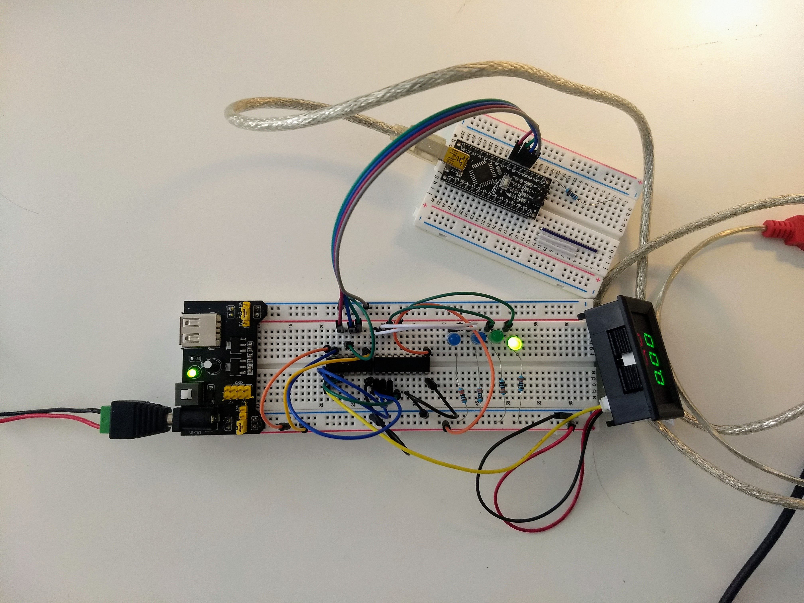

Title: Arduino Experiments
Author: SergeM
Date: 2019-07-14 14:22:00
Slug: arduino-experiments
Tags: arduino, diy, hardware, ubuntu, 


## Arduino board

[Arduino Nano v2.3 manual](https://www.arduino.cc/en/uploads/Main/ArduinoNanoManual23.pdf) (pdf)


## Arduino and shift register 74HC595

74HC595 [Datasheet](https://www.diodes.com/assets/Datasheets/74HC595.pdf) (pdf)

Youtube tutorial with buttons:

<iframe width="560" height="315" src="https://www.youtube.com/embed/ameNT2MKDyE" frameborder="0" allow="accelerometer; autoplay; encrypted-media; gyroscope; picture-in-picture" allowfullscreen></iframe>

[Tutorial with arduino](https://labalec.fr/erwan/?p=1288) - I was using that.

My version on a breadboard:



Code:
```c++
//the pins we are using
int latchPin = 2;
int clockPin = 3;
int dataPin = 4;


void setup() {
  //set all the pins used to talk to the chip
  //as output pins so we can write to them
  pinMode(latchPin, OUTPUT);
  pinMode(clockPin, OUTPUT);
  pinMode(dataPin, OUTPUT);
}
 
void loop() {
  for (int i = 0; i < 16; i++) {
 
    //take the latchPin low so the LEDs don't change while we are writing data
    digitalWrite(latchPin, LOW);
 
    //shift out the bits
    shiftOut(dataPin, clockPin, MSBFIRST, i);  
 
    //take the latch pin high so the pins reflect
    //the data we have sent
    digitalWrite(latchPin, HIGH);

    // pause before next value:
    delay(50);
  }
}
```

## Issues with upload to Arduino Nano v3 

Trying to connect to my Arduino clone (JOY-IT Arduino-compatible Nano V3 Board with ATmega328P-AU) from Ubuntu 18 I got a strange error messages.

There are three ways you can install Arduin IDE in ubuntu 18:
* `sudo apt install arduino` - install version 1.0.5 as on 2019-07-04 
* `arduino-mhall119` 1.8.5 via snap and `Ubuntu Software` app
* arduino IDE 1.8.9 from [https://www.arduino.cc/en/guide/linux](https://www.arduino.cc/en/guide/linux)

First of all I had to add a current user to `dialout` group and logout-login -- that's fine:
```bash
sudo usermod -a -G dialout <username>
```

Then all the tutorials require for checking 
```bash
ls -l /dev/ttyACM*
``` 
And I don't have that. 
I have USB0 instead:
```bash
sudo ls -l /dev/ttyUSB*
crw-rw---- 1 root dialout 188, 0 Jul 14 14:11 /dev/ttyUSB0
```

When I tried to upload some simple programms to the board I got:
* 
```
avrdude: ser_open(): can't open device "/dev/ttyUSB0": Permission denied
```
* For version from sudo apt install:
```
arduino nano avrdude: ser_open(): can't open device "COM1": No such file or directory
```
That version was way too old.

* For the version from website I got
```
Build options changed, rebuilding all
Sketch uses 994 bytes (3%) of program storage space. Maximum is 30720 bytes.
Global variables use 9 bytes (0%) of dynamic memory, leaving 2039 bytes for local variables. Maximum is 2048 bytes.
avrdude: stk500_recv(): programmer is not responding
avrdude: stk500_getsync() attempt 1 of 10: not in sync: resp=0x00
avrdude: stk500_recv(): programmer is not responding
avrdude: stk500_getsync() attempt 2 of 10: not in sync: resp=0x00
```
That was almost fine. 

To fix that I had to chose  **Tools -> Processor -> ATmega 328P (old bootloader)** instead of just "ATmega 328P"
