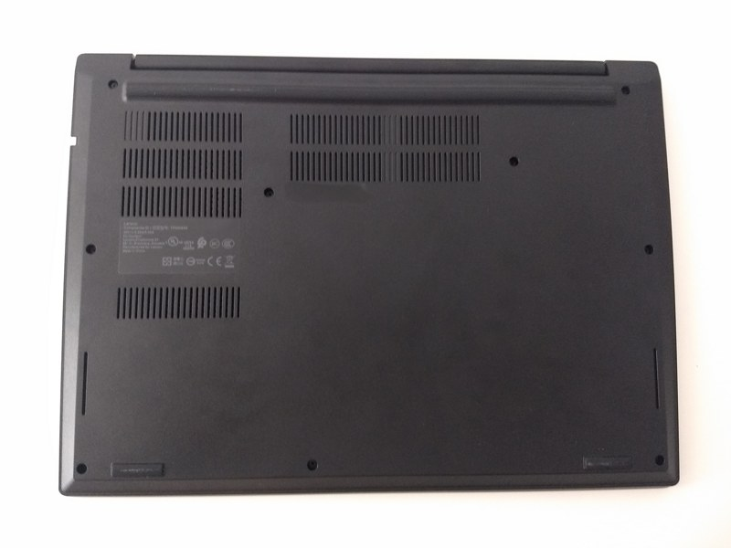
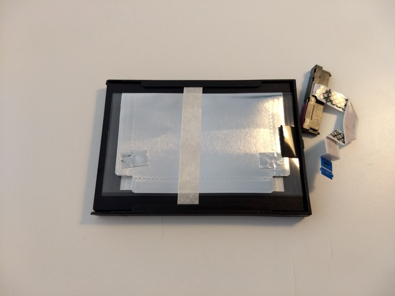
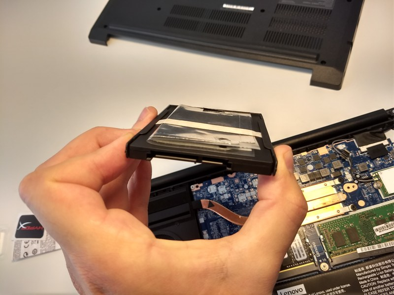
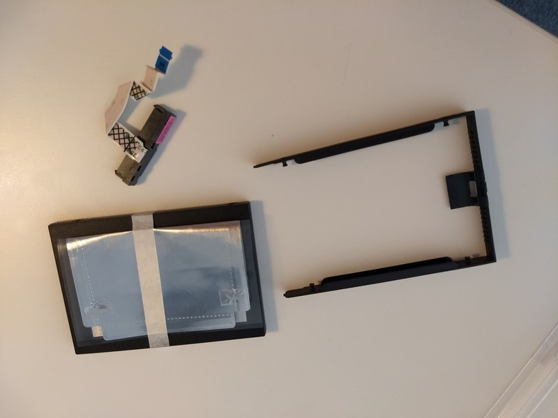

Title: Lenovo E490 memory upgrade
Author: SergeM
Date: 2019-07-16 00:01:00
Slug: lenovo-e490
Tags: lenovo,thinkpad,e490

Lenovo e490 is a cheaper and less performant alternative to the famous T series.

The laptop came to me with a deformed box but I decided to give it a try and so far so good.

I have bought a basic version and upgraded RAM for it. Here are some photos about disassembly process.

To open the case one hast to unscrew several screws and accurately open the blexible cover using some non-sharp tool (like guitar pick).

Internals:

Internals with added memory plane:

There is also an empty ssd slot that is filled with a plastic placeholder:

