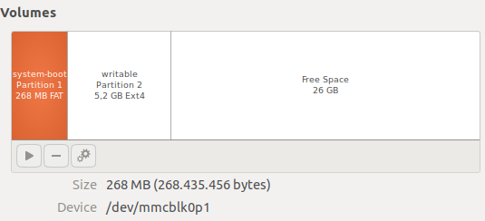

Title: ROS experience
Author: SergeM
Date: 2019-08-24 20:32:00
Slug: ros-experience
Tags: ros, linux, robotics, raspberry, pi, ubuntu, melodic


Here will be some notes on ROS.


## ROS on raspberry pi
There is a compiled image by ubiquity that contain ROS kinetic.

[https://downloads.ubiquityrobotics.com/pi.html](https://downloads.ubiquityrobotics.com/pi.html).

It seems for me too old. It's 2019, there are ubuntu 18, ros melodic and ros2, next year the support of python2.7 will be discontinued. Meh... 


## Installing tensorflow for ROS on raspberry pi
Alternatively one can try to install it from wheels:
https://www.tensorflow.org/install/pip?lang=python3#package-location

The dependencies are better to install using pip and piwheels.org:
```
sudo pip3 install --extra-index-url=https://www.piwheels.org/simple -U tensorflow keras
```

### Issues
#### h5py
I encountered an error about h5py: 
```
ImportError: libhdf5_serial.so.100: cannot open shared object file: No such file or directory
```
installing 
```
sudo apt-get install libhdf5-dev
sudo apt-get install libhdf5-serial-dev
```
didnt help.

Some version mismatch

I could resolve it by compiling h5py with my version:
```
HDF5_VERSION=1.8.16 sudo pip3 install --no-binary=h5py h5py
```

#### load_img

`keras_preprocessing.image.utils.load_img` results in the error:
```
  File "/home/ubuntu/sergem_robocar/py3/lib/python3.5/site-packages/keras_preprocessing/image/utils.py", line 108, in load_img
    raise ImportError('Could not import PIL.Image. '
ImportError: Could not import PIL.Image. The use of `load_img` requires PIL.
```

pillow is installed. 

The error may be caused by missing jpeg libraries. Try to load PIL in a separate python and check if it works.
I got the following error.
```python
>>> from PIL import Image as pil_image
Traceback (most recent call last):
  File "<stdin>", line 1, in <module>
  File "/home/ubuntu/sergem_robocar/py3/lib/python3.5/site-packages/PIL/Image.py", line 95, in <module>
    from . import _imaging as core
ImportError: libjpeg.so.62: cannot open shared object file: No such file or directory
```

Easily solvable by 
```
sudo apt install libjpeg62
```


## Name clash in dynamic_reconfigure
Probably it is written somewhere but I haven't read the docs...

I am developign a node for robot steering translation. I got an error:
```
$ rosrun steering_translator steering_translator.py 
Traceback (most recent call last):
  File "/home/user/omicron_robocar/catkin_ws/src/steering_translator/src/steering_translator.py", line 5, in <module>
    import steering_translator.cfg
  File "/home/user/omicron_robocar/catkin_ws/src/steering_translator/src/steering_translator.py", line 5, in <module>
    import steering_translator.cfg
ImportError: No module named cfg
```

I did everything according to the tutorials [How to Write Your First .cfg File](http://wiki.ros.org/dynamic_reconfigure/Tutorials/HowToWriteYourFirstCfgFile)
and [Setting up Dynamic Reconfigure for a Node (python)](http://wiki.ros.org/dynamic_reconfigure/Tutorials/SettingUpDynamicReconfigureForANode%28python%29), just changed couple of names.
The problem was in the naming of the package (steering_translator) and the executable file (steering_translator.py). They are getting mixed up on the execution. The solution was to rename python file to steering_translator_node.py.


## ROS melodic on Raspberry Pi 3 B+

Let's say we want to install ROS-melodic on RPi 3.
Here is the plan

### Prepare ubuntu 18 LTS for Raspberry Pi

* go to [Ubuntu PaspberryPi](https://wiki.ubuntu.com/ARM/RaspberryPi), download 18.04 LTS: ubuntu-18.04.3-preinstalled-server-arm64+raspi3.img.xz image

* write the image to SD card

There is some cloud-init function in that image but I didn't manage to make it work. It seems some people are more successful with that: https://gitlab.com/Bjorn_Samuelsson/raspberry-pi-cloud-init-wifi.git 


### Connecting 

* insert the flash card into the Raspberry
* Switch on the Raspberry


* It turned out that Raspberry pi cannot connect to my laptop directly with the default ethernet settings
  (something is wrong with my DHCP settings). 

  * One option is to use router:

      * Connect RPi to a router with a cable 
      * connect your laptop to the same router
      
  * Another option is to change the settings of the connection on the laptop so that the connection in shared. This way IP gets automatically assigned to both laptop and Raspberry.
    


  * find the ip address of the Raspberry with one of the commands:
     * `nmap -sn YOUR_ROUTER_IP/24` (the command may differ depending on the DHCP settings of your router)
     * `arp -a` to find the IP addresses of the connected devices.
  * `ssh ubuntu@RASPBERRY_IP`, use password `ubuntu`
  
### Update the system

    sudo apt update
    sudo apt upgrade

If update doesn't work the reason could be time syncronization between ubuntu servers and raspberry py. Try to install ntp: `sudo apt install ntp`

### Enabling wifi connection

* install NetworkManager: 

      sudo apt install network-manager


* enable network manager

      sudo systemctl enable NetworkManager
      sudo systemctl start NetworkManager


* add a connection to your Wifi router 

      nmcli device wifi rescan
      nmcli device wifi list
      nmcli device wifi connect SSID-Name password PASSWORD

#### Enable hotspot on RaspberryPi (ubuntu 18.04)
Enabling hotspot on raspberry allows connection via Wifi without having a router
* install and enable network manager as described above
* `sudo nmcli dev wifi hotspot ifname wlan0 ssid ub_rpi_net password "robotrobot"`
* to change the default IP address range modify `ipv4` section in `/etc/NetworkManager/system-connections/Hotspot`:

```
[ipv4]
dns-search=
method=shared
address1=192.168.111.1/24,192.168.111.1
```
    
### Install other necessary tools
...

### Install ROS

...


### Creating an image of the SD card for recovery

Assuming `/dev/mmcblk0` is your SD card.

Creating compressed image:
```
dd bs=1M count=<size_in_MBs> if=/dev/mmcblk0 | gzip -c --fast| dd of=/path/to/image.gz
```

`size_in_MB` can be used copy the disk partially in case you have only a little data in the beginning of the large SD card.



Recovery:

```
dd if=/path/to/image.gz | gunzip -c | dd bs=1M of=/dev/mmcblk0
```

to copy the data back onto different disk

### Some guides:

* https://roboticsbackend.com/install-ros-on-raspberry-pi-3/

* https://www.youtube.com/watch?v=VFuHG-Ho4Fk

* https://roboticsweekends.blogspot.com/2017/12/how-to-install-ros-on-raspberry-pi-2-or.html

* https://wiki.ros.org/ROSberryPi/Installing%20ROS%20Kinetic%20on%20the%20Raspberry%20Pi

