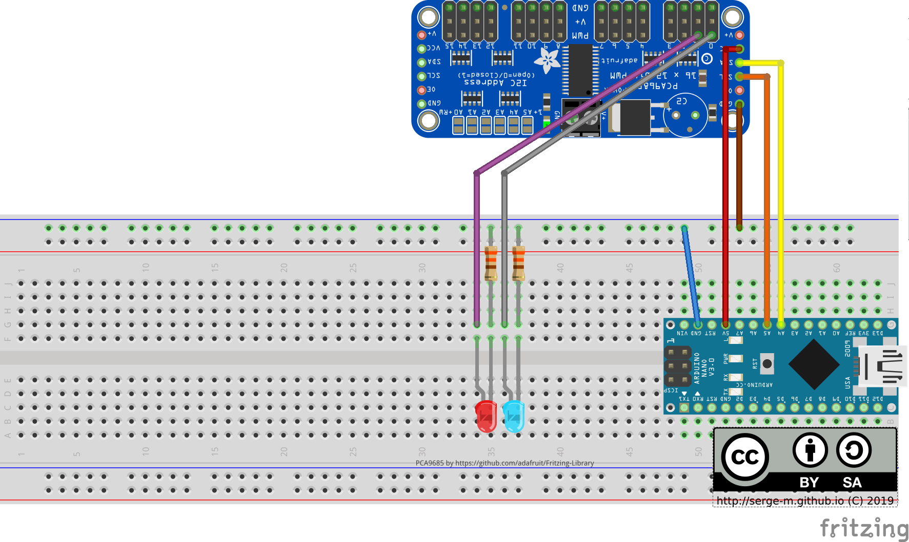
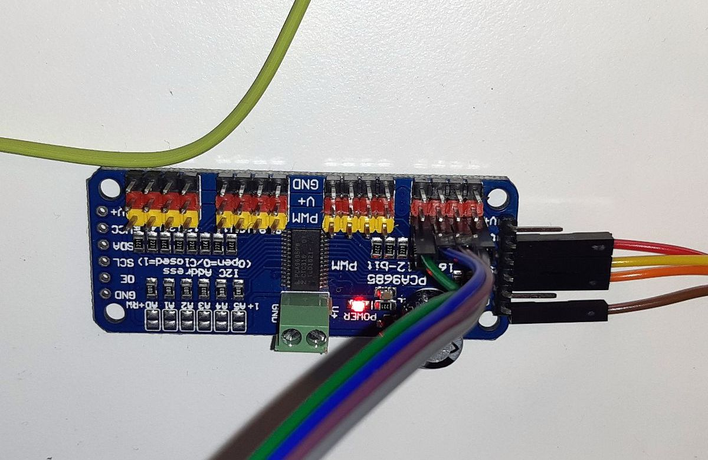

:date: 2019-12-25 13:10

:title: Blinking multiple LEDs with Arduino (ATMega328p) and PCA9685

:author: SergeM

:slug: blinking-multiple-leds-with-arduino-atmega328p-and-pca9685

:tags: arduino, pwm, pca9685, LED, c++

Arduino (ATMega328p) boards can be used to control multiple LEDs. To simplify the management of the
pulse width modulation and use only a couple of arduino's pins for many LEDs I used PCA9685 controller.

PCA9685 is connected to Arduino using I2C interface that requires only two data pins.

.. image:: media/2019-12-blinking-multiple-leds-with-arduino-atmega328p-and-pca9685/sketch_schem.png
  :width: 600px
  :alt: schema Blinking multiple LEDs with Arduino (ATMega328p) and PCA9685

.. image:: media/2019-12-blinking-multiple-leds-with-arduino-atmega328p-and-pca9685/foto1.jpg
  :width: 600px
  :alt: foto1 Blinking multiple LEDs with Arduino (ATMega328p) and PCA9685

Arduino connects to PCA9685 using :code:`Adafruit_PWMServoDriver` library:

.. code-block:: cpp

    #include <Adafruit_PWMServoDriver.h>

    Adafruit_PWMServoDriver pwm = Adafruit_PWMServoDriver();

Initialization in :code:`setup()`:

.. code-block:: cpp

      pwm.begin();
      pwm.setPWMFreq(1600);  // This is the maximum PWM frequency

Then for each loop we will blink with 2 LEDs. That can be easily extended to more LEDs:

Initialization in :code:`setup()`:

.. code-block:: cpp

    void loop() {
      // set state 1
      digitalWrite(LED_BUILTIN, HIGH);
      pwm.setPWM(0, 0, 3072);
      pwm.setPWM(1, 0, 4096);

      // wait
      delay(500);

      // set state 2
      digitalWrite(LED_BUILTIN, LOW);
      pwm.setPWM(0, 0, 4096);
      pwm.setPWM(1, 0, 4095);

      // wait
      delay(500);

    }

:code:`pwm.setPWM(p, start, end);` means that for the pin :code:`p`
the signal should transition from low to high at tick :code:`start` (between 0..4095)
and the signal should transition from high to low at tick :code:`end` (between 0..4095).

There are special settings for full on and full off.
Full on:

.. code-block::

  pwm.setPWM(pin, 4096, 0);

Full off:

.. code-block::

  pwm.setPWM(pin, 0, 4096);

Along with the other LED we will also control an LED that is built in the Arduino:

.. code-block:: cpp

    void setup() {
      pinMode(LED_BUILTIN, OUTPUT);
      // ...
    }

    void loop() {
      digitalWrite(LED_BUILTIN, HIGH); // LED on
      // ...
      digitalWrite(LED_BUILTIN, LOW);  // LED off
      // ...
    }

Here is the full listing:

.. code-block:: cpp

    #include <Adafruit_PWMServoDriver.h>

    Adafruit_PWMServoDriver pwm = Adafruit_PWMServoDriver();

    void setup() {
      pinMode(LED_BUILTIN, OUTPUT);

      pwm.begin();
      pwm.setPWMFreq(1600);  // This is the maximum PWM frequency
    }

    void loop() {
      // set state 1
      digitalWrite(LED_BUILTIN, HIGH);
      pwm.setPWM(0, 0, 3072);
      pwm.setPWM(1, 0, 4096);

      // wait
      delay(500);

      // set state 2
      digitalWrite(LED_BUILTIN, LOW);
      pwm.setPWM(0, 0, 4096);
      pwm.setPWM(1, 0, 4095);

      // wait
      delay(500);

    }

Results:

.. raw:: html

    

        <iframe width="560" height="315" src="https://www.youtube.com/embed/WLwGtT4PEsE" frameborder="0" allow="accelerometer; autoplay; encrypted-media; gyroscope; picture-in-picture" allowfullscreen></iframe>
    

