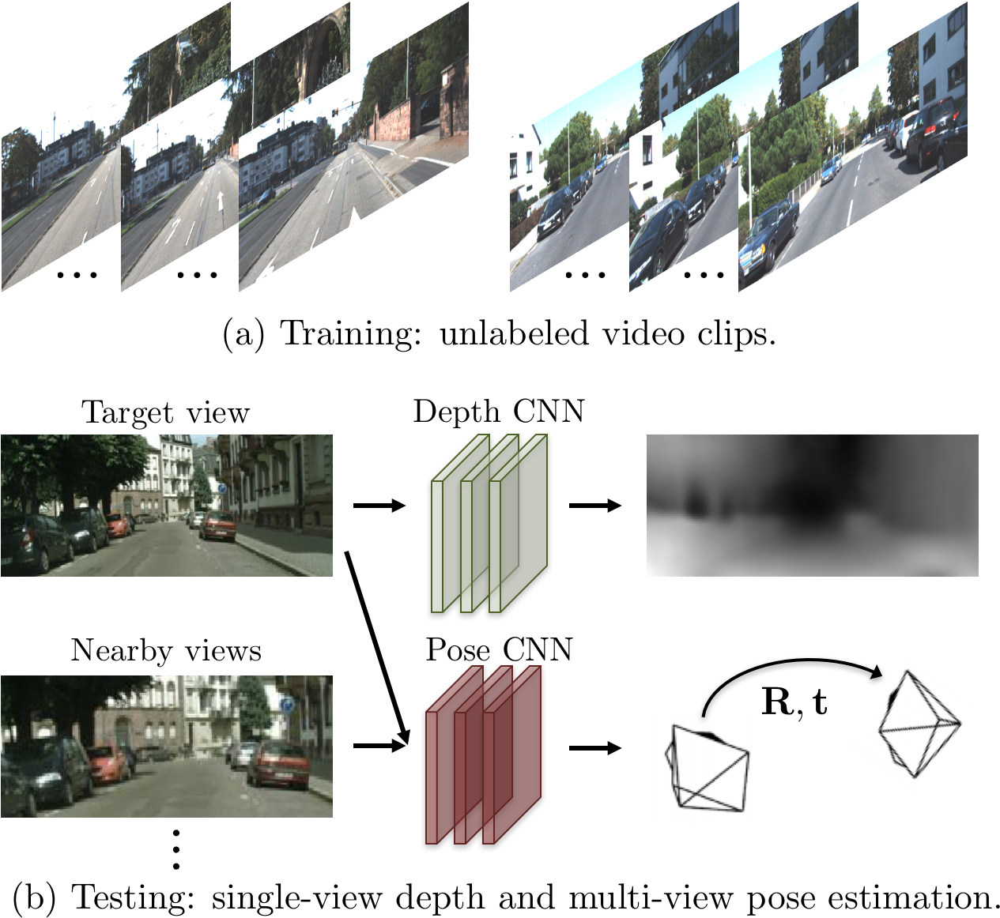

:date: 2020-08-23 19:00:00

:title: Self-supervised depth and ego motion estimation

:author: SergeM

:slug: self-supervised-depth-and-ego-motion

:tags: machine learning, computer vision, DNN, CNN, deep learning, depth, ego motion.

3D Packing for Self-Supervised Monocular Depth Estimation
--------------------------------------------------------------

by Vitor Guizilini, `pdf at arxiv <https://arxiv.org/pdf/1905.02693.pdf>`_, 2020

Learning

1. Depth estimator :math:`f_D : I \rightarrow D`

2. Ego motion estimator: :math:`f_x : (I_t , I_S) \rightarrow x_{t \rightarrow S}`

Depth Estimator
=====================================

They predict an inverse depth and use a packnet architecture.

Inverse depth probably has more stable results. Points far away from camera have small inverse depth that with low precision. The nearer points have  more information

Probably they assume that the scene is rigid and there is no moving objects. It is likely to give some errors for the moving objects. How do they deal with the moving objects?

Ego motion estimator
======================================

They use a rather simple CNN from SfMLearner.

Loss function
==================================
Loss function consists of three parts.
1. appearance loss
2. depth smoothness loss
3. velocity scaling loss

SfMLearner
--------------------------------------------------
paper: Unsupervised Learning of Depth and Ego-Motion from Video
by Berkley and google

`pdf <https://people.eecs.berkeley.edu/~tinghuiz/projects/SfMLearner/cvpr17_sfm_final.pdf>`__

One of the previous works, that became a foundation for 3d-pack.

`Official website <https://people.eecs.berkeley.edu/~tinghuiz/projects/SfMLearner/>`_.

Github: `https://github.com/tinghuiz/SfMLearner <https://github.com/tinghuiz/SfMLearner>`__.

Implementation in pytorch:
`SfmLearner-Pytorch <https://github.com/ClementPinard/SfmLearner-Pytorch/blob/master/models/PoseExpNet.py>`_

.. raw:: html

    

        <iframe width="560" height="315" src="https://www.youtube.com/embed/RTFatijYcaU" frameborder="0" allow="accelerometer; autoplay; encrypted-media; gyroscope; picture-in-picture" allowfullscreen></iframe>
    

Depth from Videos in the Wild
-----------------------------------------------------
Depth from Videos in the Wild: Unsupervised Monocular Depth Learning from Unknown Cameras
by Ariel Gordon et al, 2019.

https://research.google/pubs/pub48440/

`pdf <https://research.google/pubs/pub48440.pdf>`__

`github <https://github.com/google-research/google-research/tree/master/depth_from_video_in_the_wild>`__

Here they learn not only depth and R/t but also intrinsics of the camera

struct2depth
-----------------------------------------------------
Depth Prediction Without the Sensors: Leveraging Structure for UnsupervisedLearning from Monocular Videos

Paper by google

`site <https://sites.google.com/view/struct2depth>`__

`code <https://github.com/tensorflow/models/tree/archive/research/struct2depth>`__

based on vid2depth

vid2depth
-------------------------------------------------------
another paper by google.

`github <https://github.com/tensorflow/models/tree/master/research/vid2depth>`__

based on sfm learner

monodepth2 - Digging Into Self-Supervised Monocular Depth Estimation
---------------------------------------------------------------------------------

`arxiv <https://arxiv.org/pdf/1806.01260.pdf>`__

`github <https://github.com/nianticlabs/monodepth2>`__

some method that 3D Packing use as a competitor.

RealMonoDepth: Self-Supervised Monocular Depth Estimation for General Scenes
---------------------------------------------------------------------------------------------------------------------------------------------------

self-supervised from stereo and mono.

by deepai:
`https://deepai.org/publication/realmonodepth-self-supervised-monocular-depth-estimation-for-general-scenes <https://deepai.org/publication/realmonodepth-self-supervised-monocular-depth-estimation-for-general-scenes>`__.

They claim to be better than monodepth2 and mode generalized than depth_from_video_in_the_wild "Depth from Videos in the Wild".
However they require camera calibration and median depth to be estimated prior to processing with an external tool.
(`COLMAP <https://colmap.github.io/>`_). Not really "in the wild".

They were able to train on multiple scenes with different depth ranges.
The method still requires a static scene for the training. For example they use data from Mannequin Challenge
to train their models. Then the network can be used on dynamic scenes with people.

The code is not available so far.

