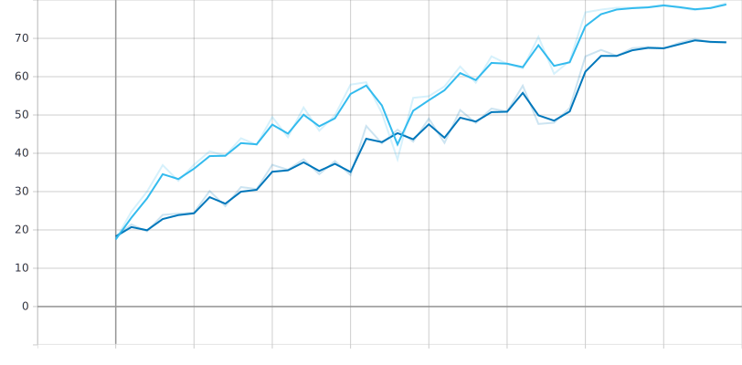
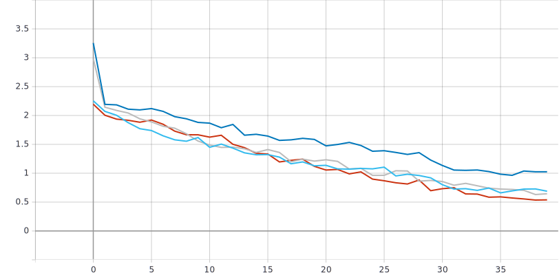

Title: Effect of techniques from Fast.ai
Author: SergeM
Date: 2020-11-15 10:00:00
Slug: effect-of-techniques-from-fastai
Tags: pytorch, deep learning, computer vision, neural networks, fast.ai, fastai, AdamW, learning rate, LRfinder, pytorch-nn-tools, resnet, one cycle 

`fast.ai` is a brilliant [library](https://github.com/fastai/fastai) and a [course](https://course.fast.ai/) 
by Jeremy Howard an co. They use pytorch as a base and explain 
deep learning from the foundations to a very decent level. 
In his course Jeremy Howard demonstrates a lot of interesting techniques 
that he finds in papers and that do NN training faster/better/cheaper.

Here I want to reproduce some of the techniques in order to understand what is the effect they bring.

I don't want to use [fastai library](https://github.com/fastai/fastai) here for two reasons. 
First, for better understanding of the processes it 
is better to implement them by yourself.  
Second, I think the library has certain disadvantages and it is better to 
stick to pytorch as close as possible. 
Fastai introduces too many layers of indirection between the user and pytorch.
It is very convenient for the beginners or for standard use cases. 
But as soon as you need something more advance you basically have 
to digg through ALL the layers of fastai to get what you want. 
I started building another [library](https://pypi.org/project/pytorch-nn-tools/) 
that incorporates techniques from fast ai, but doesn't force the user to 
stick to the library. Hopefully. Thus I am going to use that library for my tests. 


## Task

I am going to train an image classifier 
based on Resnet18 from pytorch. 
The classifier has to distinguish between the dog breeds from
an excellent [Imagewoof](https://github.com/fastai/imagenette#imagewoof) dataset. The dataset
is designed by Jeremy Howard again to 
for learning purposes. the dataset is small enough to 
to fast experimentation. But it also large enough and sophisticated enough
to make results and insights applicable for real datasets like Imagenet.

    
## Baseline

I am going to start from SGD with 40 epochs, LR=0.1 for the first 30 epochs and 0.01 for epochs 30-40.

Installing dependencies:
```sh
pip install pytorch-nn-tools==0.3.3 torch_lr_finder==0.2.1
```

```python
import os

import torch
import torch.nn.parallel
import torch.utils.data
import torchvision
import torchvision.datasets as datasets
import torchvision.models as models
import torchvision.transforms as transforms
import numpy as np

import matplotlib.pyplot as plt
import torch.nn.functional as F
from collections import defaultdict
from typing import Dict, List, Callable, Union
from pathlib import Path
import json
import time
import datetime


from fastprogress.fastprogress import master_bar, progress_bar
from time import sleep

from pytorch_nn_tools.visual import UnNormalize_, imagenet_stats
from pytorch_nn_tools.train.metrics.processor import mod_name_train, mod_name_val, Marker
from pytorch_nn_tools.train.metrics.processor import MetricAggregator, MetricLogger, MetricType
from pytorch_nn_tools.train.progress import ProgressTracker
from pytorch_nn_tools.convert import map_dict
from pytorch_nn_tools.train.metrics.history_condition import HistoryCondition
from pytorch_nn_tools.train.checkpoint import CheckpointSaver
```

Functions for generating datasets

```python
def _train_dataset(path):
    normalize = transforms.Normalize(
        mean=[0.485, 0.456, 0.406],
        std=[0.229, 0.224, 0.225],
    )

    train_dir = os.path.join(path, 'train')
    train_dataset = datasets.ImageFolder(
        train_dir,
        transforms.Compose([
            transforms.RandomResizedCrop(224),
            transforms.RandomHorizontalFlip(),
            transforms.ToTensor(),
            normalize,
        ]))
    return train_dataset


def _val_dataset(path):
    normalize = transforms.Normalize(
        mean=[0.485, 0.456, 0.406],
        std=[0.229, 0.224, 0.225],
    )
    val_dir = os.path.join(path, 'val')
    dataset = datasets.ImageFolder(val_dir, transforms.Compose(
        [transforms.Resize(256), transforms.CenterCrop(224), transforms.ToTensor(), normalize, ]))
    return dataset

```

Settings and data loaders:

```python
batch_size_train = 128
batch_size_val = 16
device = 'cuda'


data_path = "data/imagewoof2-320/"

train_dataloader = torch.utils.data.DataLoader(
        dataset=_train_dataset(data_path),
        batch_size=batch_size_train,
        shuffle=True, 
        num_workers=num_workers,
    )
    
val_dataloader = torch.utils.data.DataLoader(
        dataset=_val_dataset(data_path),
        batch_size=batch_size_val,
        shuffle=False,
        num_workers=num_workers,
    )
```

Accuracy function from pytorch-lightning:


```python
def accuracy(output, target, topk=(1,)):
    """Computes the accuracy over the k top predictions for the specified values of k"""
    with torch.no_grad():
        maxk = max(topk)
        batch_size = target.size(0)

        _, pred = output.topk(maxk, 1, True, True)
        pred = pred.t()
        correct = pred.eq(target.view(1, -1).expand_as(pred))

        res = []
        for k in topk:
            correct_k = correct[:k].view(-1).float().sum(0, keepdim=True)
            res.append(correct_k.mul_(100.0 / batch_size))
        return res
```

Some helper functions:

```python
def to_device(batch, device):
    return batch.to(device)

from fastprogress.fastprogress import master_bar, progress_bar

class PBars:
    def __init__(self):
        self._main = None
        self._second = None
        
    def main(self, it, **kwargs):
        self._main = master_bar(it, **kwargs)
        return self._main
    
    def secondary(self, it, **kwargs):
        if self._main is None:
            raise RuntimeError("Cannot instantiate secondary progress bar. The main progress bar is not set.")
        self._second = progress_bar(it, parent=self._main, **kwargs)
        return self._second
        
    def main_comment(self, comment):
        self._main.main_bar.comment = comment
        
def now_as_str():
    now = datetime.datetime.now()
    return now.strftime("%Y%m%d_%H%M%s_%f")

class DummyLogger:
    def debug(self, *args):
        print(*args)

```

TrainerIO is responsible for logging and checkpointing.
That is the class that does IO on behalf of a trainer.
It can 1) instantiate metric logger. 2) load last checkpoint and 3) save checkpoints

```python
class TrainerIO:
    def __init__(self, log_dir: Union[Path, str], experiment_name: str, checkpoint_condition: Callable[[MetricType], bool]):
        self.log_dir = Path(log_dir)
        self.experiment_name = experiment_name
        self.path_experiment = self.log_dir.joinpath(experiment_name)
        self.path_checkpoints = self.path_experiment.joinpath("checkpoints")
        self.checkpoint_saver = CheckpointSaver(self.path_checkpoints, logger=DummyLogger())
        self.checkpoint_condition = checkpoint_condition
    
    def create_metric_logger(self):
        path_logs = self.path_experiment.joinpath(f"{self.experiment_name}_{now_as_str()}")
        metric_logger = MetricLogger(path_logs)
        return metric_logger
    
    def load_last(self, start_epoch: int, end_epoch: int, model, optimizer, scheduler) -> int:
        last = self.checkpoint_saver.find_last(start_epoch, end_epoch)
        if last is not None:
            print(f"found pretrained results for epoch {last}. Loading...")
            self.checkpoint_saver.load(model, optimizer, scheduler, last)
            return last + 1
        else:
            return start_epoch
    
    def save_checkpoint(self, metrics: MetricType, model, optimizer, scheduler, epoch):
        if self.checkpoint_condition(metrics): 
            self.checkpoint_saver.save(model, optimizer, scheduler, epoch)
    
```


Now goes the trainer. In fastai and pytorch-lightning frameworks 
the trainers are implemented inside the library. The user has to use callbacks of inheritance 
in order to patch the standard trainer loop.
That means the trainer has to be overly generic. For each case the user has to know how 
which callback to use and how the result of that callback influences the training logic.
That look like a leaking abstraction to me. In that case the library doesn't really abstract anything. 
The user has to know all the internals in order to do even moderately difficult things with it.

I have a hypothesis that it is possible to inverse that dependency. I want the user to write a training
loop on it's own. I want my library to provide helper functions for that in order to make it super easy.

The biggest part of the training loop is IO: checkpointing, logging, data loading. There is 
very little amount of logic. I hypothesize that it may has no sense to extract it to a library. Let
the user write it, but make it simple.

It's not a finalized version btw. Some of the parts may be included into `pytorch-nn-tools` 
in the future. 

The trainer has main function `fit(...)` that calls `train_epoch(...)` and `validate_epoch(...)`.


```python
class Trainer:
    def __init__(self, device, trainer_io: TrainerIO,
                continue_training: bool = False):
        self.device = device
        self.continue_training = continue_training
        self.trainer_io = trainer_io
        self.pbars = PBars()
        
        
    def fit(self, model, optimizer, scheduler, start_epoch, end_epoch):
        metric_logger = self.trainer_io.create_metric_logger()
        
        model = model.to(self.device)
        
        if self.continue_training:
            start_epoch = self.trainer_io.load_last(start_epoch, end_epoch, model, optimizer, scheduler)

        progr_train = ProgressTracker()
        
        for epoch in self.pbars.main(range(start_epoch, end_epoch)):
            metric_aggregator = MetricAggregator()
            self.train_epoch(
                train_dataloader, progr_train,
                model, optimizer, scheduler,  
                metric_proc=mod_name_train+metric_aggregator+metric_logger,
                pbars=self.pbars,
                report_step=10,
                tb_writer=metric_logger.writer
            )
            self.validate_epoch(
                val_dataloader,
                model,  
                metric_proc=mod_name_val+metric_aggregator+metric_logger,
                pbars=self.pbars,
            )
            
            aggregated = map_dict(metric_aggregator.aggregate(), key_fn=lambda key: f"avg.{key}")
            metric_logger({
                **aggregated, 
                **{f"lr_{i}": lr for i, lr in enumerate(scheduler.get_last_lr())},
                Marker.EPOCH: epoch,
            })
            self.pbars.main_comment(f"{aggregated}")
                        
            self.trainer_io.save_checkpoint(aggregated, model, optimizer, scheduler, epoch)
            
            scheduler.step()  # for epoch-based scheduler
            
        metric_logger.close()
            
    def train_epoch(self, data_loader, progr, model, optimizer, scheduler, metric_proc, pbars, report_step=1,
                   tb_writer=None):
        model.train()
                
        for batch_idx, (images, target) in enumerate(progr.track(pbars.secondary(data_loader))):
            optimizer.zero_grad()
            
            images = to_device(images, self.device)
            target = to_device(target, self.device)
            
            output = model(images)
            loss = F.cross_entropy(output, target)
            loss.backward()
            optimizer.step()
            if progr.cnt_total_iter % report_step == 0:
                with torch.no_grad():
                    acc1, acc5 = accuracy(output, target, topk=(1, 5))

                metric_proc({
                    'loss': loss, 'acc1': acc1, 'acc5': acc5, Marker.ITERATION: progr.cnt_total_iter,
                    **{f"lr_{i}": lr for i, lr in enumerate(scheduler.get_last_lr())},
                })
                
            if batch_idx == 0:   
                if tb_writer:
                    vis = images.detach().clone()
                    for v in vis:
                        v[:] = UnNormalize_(**imagenet_stats)(v)
                    grid = torchvision.utils.make_grid(vis)
                    tb_writer.add_image('images', grid, progr.cnt_total_iter)
                    
#             scheduler.step()  # for batch based scheduler

    def validate_epoch(self, data_loader, model, metric_proc, pbars):
        model.eval()
        
        with torch.no_grad():
            for images, target in pbars.secondary(data_loader):
                images = to_device(images, self.device)
                target = to_device(target, self.device)

                output = model(images)
                loss = F.cross_entropy(output, target)
                acc1, acc5 = accuracy(output, target, topk=(1, 5))
                
                metric_proc(dict(loss=loss, acc1=acc1, acc5=acc5))

```

Finally the main part

```python
recommended_lr = 0.1
num_epochs = 40

model = models.resnet18(pretrained=False)        

optimizer = torch.optim.SGD([
    {
        'name': 'main_model',
        'params': model.parameters(),
        'lr': 0.1,
        'momentum': 0.9,
        'weight_decay': 1e-4,
    }
])

scheduler = torch.optim.lr_scheduler.LambdaLR(
    optimizer,
    lambda epoch: 0.1 ** (epoch // 30)
)

trainer_io = TrainerIO(
    log_dir="./logs/", experiment_name=f"experiment1_onecycle_lr{recommended_lr}_adamw", 
    checkpoint_condition=HistoryCondition(
        'avg.val.acc1', 
        lambda hist: len(hist) == 1 or hist[-1] > max(hist[:-1])
    )
)

trainer = Trainer(device=device, trainer_io=trainer_io, continue_training=False)

trainer.fit(
    model, optimizer, scheduler,
    start_epoch=0, end_epoch=num_epochs
)
```

In order to run the trainer the user has to define TrainerIO, model, scheduler and optimizer. 
All those parts are interconnected and essential for the process.

We achieve accuracy for top 1 about 69% and for top 5 about 96 %. That is in line with the
values that other people get for that dataset: [Imagewoof Leaderboard](https://github.com/fastai/imagenette#imagewoof-leaderboard)


*top1 accuracy*


*top5 accuracy*


## LR Finder 

One of the greatest things I found in fastai is learning rate finder. It is a technique that
helps to set up the initial (base) learning rate for the models.  

The idea is to do the iteration of the training for gradually increasing learning rate. 
The learning rate value where we see the fastest descent of the loss is a good chioce.

I am not going to write that LR finder myself and 
I use the existing module [pytorch-lr-finder](https://pypi.org/project/torch-lr-finder/), 
[github](https://github.com/davidtvs/pytorch-lr-finder).
That module works with standard pytorch concepts. 
If I would like to use the LRFinder from fast ai or pytorch lightning, I would be forced to 
use their trainers, optimizers etc.

Let's create a new model and optimizer. We start with a very low learning rate: 1e-8. The lr_finder will do 50 iterations 
up until lr=10.:

```python
model = models.resnet18(pretrained=False)        

optimizer = torch.optim.AdamW([
    {
        'name': 'main_model',
        'params': model.parameters(),
        'lr': 1e-8,
        'weight_decay': 1e-4,
    }
])

from torch_lr_finder import LRFinder

criterion = torch.nn.CrossEntropyLoss()
lr_finder = LRFinder(model, optimizer, criterion, device=device)
lr_finder.range_test(train_dataloader, val_loader=None, end_lr=10, num_iter=50, step_mode="exp")
_, recommended_lr = lr_finder.plot(log_lr=False)
lr_finder.reset()
```


My recommended LR is about 0.02. I can launch with the same optimizer, lr schedule, but with the new base LR:

```python
recommended_lr = 0.02
model = models.resnet18(pretrained=False)        

optimizer = torch.optim.SGD([
    {
        'name': 'main_model',
        'params': model.parameters(),
        'lr': recommended_lr,
        'momentum': 0.9,
        'weight_decay': 1e-4,
    }
])

scheduler = torch.optim.lr_scheduler.OneCycleLR(
    optimizer,
    max_lr=recommended_lr,
    epochs=num_epochs,
    steps_per_epoch=len(train_dataloader)
)
```

Here also we have to patch our trainer. Scheduler step now happens for each training batch, not per epoch.

```python
class Trainer:
    # .....
        
    def fit(self, model, optimizer, scheduler, start_epoch, end_epoch):
        # ....
        
        for epoch in self.pbars.main(range(start_epoch, end_epoch)):
            # .....
            self.trainer_io.save_checkpoint(aggregated, model, optimizer, scheduler, epoch)
            
            # not needed any more
            # scheduler.step() 
            
        metric_logger.close()
            
    def train_epoch(self, data_loader, progr, model, optimizer, scheduler, metric_proc, pbars, report_step=1,
                   tb_writer=None):
        model.train()
                
        for batch_idx, (images, target) in enumerate(progr.track(pbars.secondary(data_loader))):
            # ...
                
            if batch_idx == 0:   
                # ...
                    
            # now we do scheduler step for every batch
            scheduler.step() 

    def validate_epoch(self, data_loader, model, metric_proc, pbars):
        # stays the same
        # ...
```

Let's run:

```python
trainer_io = TrainerIO(
    log_dir="./logs/", experiment_name=f"experiment_base_lr{recommended_lr}", 
    checkpoint_condition=HistoryCondition(
        'avg.val.acc1', 
        lambda hist: len(hist) == 1 or hist[-1] > max(hist[:-1])
    )
)

trainer = Trainer(device=device, trainer_io=trainer_io, continue_training=False)

trainer.fit(
    model, optimizer, scheduler,
    start_epoch=0, end_epoch=num_epochs
)

```


 
*train loss. lr=0.1 vs lr=0.02 found by LRFinder*

Top 1 Accuracy improved significantly from 0.69 to 0.78!

 
*top 1 accuracy on validation. lr=0.1 vs lr=0.02 found by LRFinder*

 
 
## One Cycle learning rate
 
Another technique is to have a special LR schedule. We start small, ramp it up quickly to the maximum and then 
gradually decrease.

Here is how the LR graphs look like:


*learning rate schedules. Gray line is a "one cycle"*
  
We don't get accuracy increase here. But we don't need to hand craft the learning rate schedule any more. 
That is positive.

Hopefully one cycle brings some numerical stability. 


*Accuracy top 1 for one cycle. Gray line is a "one cycle"*


## AdamW

Instead of SGD let's use Adam optimizer. More specifically AdamW version of it. It was also advertised 
in fastai as a good practice.

```python
model = models.resnet18(pretrained=False)        

optimizer = torch.optim.AdamW([
    {
        'name': 'main_model',
        'params': model.parameters(),
        'lr': recommended_lr,
        'weight_decay': 1e-4,
    }
])


scheduler = torch.optim.lr_scheduler.OneCycleLR(
    optimizer,
    max_lr=recommended_lr,
    epochs=num_epochs,
    steps_per_epoch=len(train_dataloader)
)

trainer_io = TrainerIO(
    log_dir="./logs/", experiment_name=f"experiment1_onecycle_lr{recommended_lr}_adamw", 
    checkpoint_condition=HistoryCondition(
        'avg.val.acc1', 
        lambda hist: len(hist) == 1 or hist[-1] > max(hist[:-1])
    )
)

trainer = Trainer(device=device, trainer_io=trainer_io, continue_training=False)

trainer.fit(
    model, optimizer, scheduler,
    start_epoch=0, end_epoch=num_epochs
)

```  

That helps a lot. We go from 79.5% to 82.6% of accuracy: 


*Accuracy top 1 for AdamW. Dark red line is a AdamW*


*Train loss for AdamW. Dark red line is a AdamW*


## Conclusion

We used a fraction of tricks from fastai to improve the performance of our training. They all seem to be useful.
Only OneCycle scheduler didn't bring an evident benefits in the accuracy. However it brings some simplicity 
for developer.   
The numbers are still pretty far from the values on the leaderboard, but we didn't use all the tricks of course. 

Also here we verified the viability of pytorch-nn-tools library.

